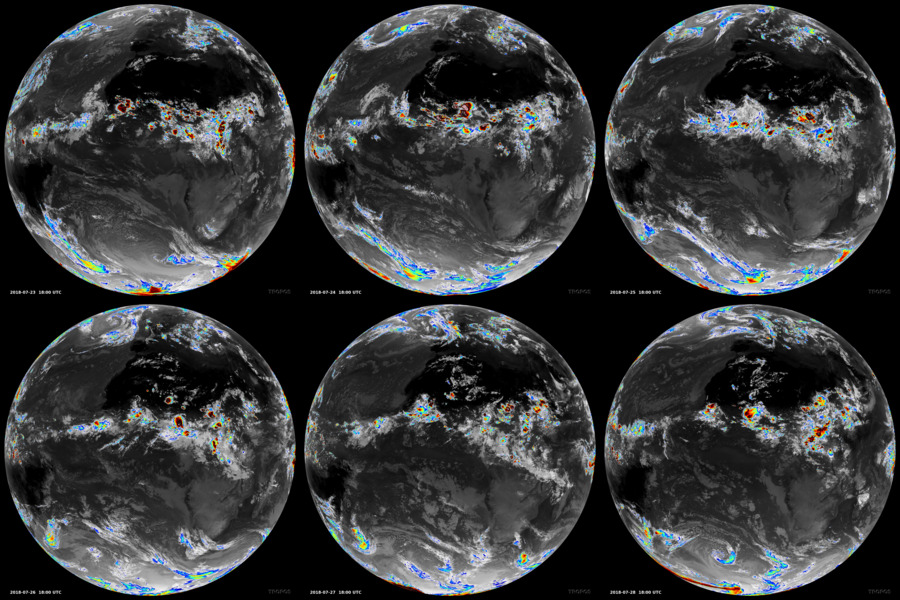

# SynSatiPy

- is a python package for atmospheric research (see [Science behind SynSatiPy](docs/Science-behind-SynSatiPy.md))

- allows to derive satellite images from weather forecasts or from climate simulation

SynSatiPy is a Python interface to the RTTOV software that help to input model data (e.g. from IFS or from ICON) and loads emissivity catalogues and sensor specific files.

## Getting Started

### Installation

Before SynsatiPy can be installed **RTTOV** must be downloaded, configured and installed on your target platform. See 
- https://nwp-saf.eumetsat.int/site/software/rttov/ or
- https://en.wikipedia.org/wiki/RTTOV_(radiative_transfer_code)

SynSatiPy can be installed via `pip`. It is recommended to install the SynSatiPy package into a separate python environment. Perhaps, the optimal way is to adjust this tutorial to your needs:
- [SynSatiPy Installation on DKRZ Levante](docs/Installation_on_Levante.md)

### Using SynSatiPy
SynSatiPy can be import inside python scripts or jupyter notebooks. Examples are provided in the folder [Example Notebooks](docs/examples/) 

### User Guide
Further documentation is provided here: RTD (TODO).

## Contributing
Please feel invited to contributed to the SynSatiPy python package (via pull requests). Possible extension are (not exclusive):
- implementation of further satellite sensor interfaces
- implementation of further model input interfaces

Please provide bug reports or ideas for extensions as issues!

