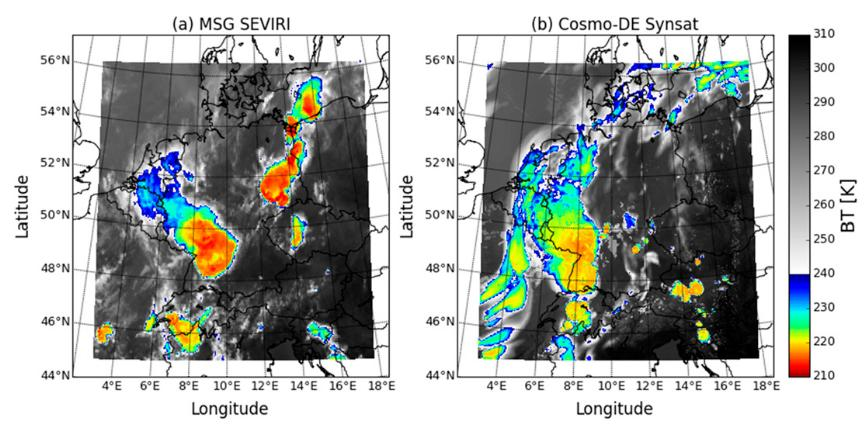

# SynSatiPy

- is a python package for atmospheric research

- allows to derive satellite images from weather forecasts or from climate simulation

SynSatiPy is a Python interface to the RTTOV software that help to input model data (e.g. from IFS or from ICON) and loads emissivity catalogues and sensor specific files.

## Getting Started

### Installation

Before SynsatiPy can be installed **RTTOV** must be downloaded, configured and installed on your target platform. See 
- https://nwp-saf.eumetsat.int/site/software/rttov/ or
- https://en.wikipedia.org/wiki/RTTOV_(radiative_transfer_code)

SynSatiPy can be installed via `pip`. It is recommended to install the SynSatiPy package into a separate python environment. Perhaps, the optimal way is to adjust this tutorial to your needs:
- [SynSatiPy Installation on DKRZ Levante](docs/Installation_on_Levante.md)

### Using SynSatiPy
SynSatiPy can be import inside python scripts or jupyter notebooks. Examples are provided in the folder [Example Notebooks](docs/examples/) 

### User Guide
Further documentation is provided here: RTD (TODO).

## Contributing
Please feel invited to contributed to the SynSatiPy python package (via pull requests). Possible extension are (not exclusive):
- implementation of further satellite sensor interfaces
- implementation of further model input interfaces

Please provide bug reports or ideas for extensions as issues!

## Science behind SynSatiPy

Earlier version of the SynSat interface were utilized for scientific studies with various research targets, for instance to

- assess the realism of cloud characteristics in super high-resolution ICON simulations over Germany (https://doi.org/10.1002/qj.2947)

    

- investigate SynSat uncertainties in the presence of Cirrus clouds (https://doi.org/10.1016/j.atmosres.2016.08.012)

    

- characterize quality weather forecasts of deep convective development (https://doi.org/10.1175/MWR-D-16-0480.1)

    

- evaluate simulated deep tropical convection (https://doi.org/10.1175/MWR-D-17-0378.1)

    

- study convective organization over Germany (https://doi.org/10.1002/qj.3552)

    

- support development of innovate convection parameterizations (https://doi.org/10.1175/MWR-D-20-0107.1)
    

- study cloud radiative effects by cloud type (https://doi.org/10.1029/2020JD032667)
    
