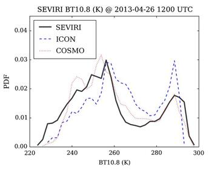
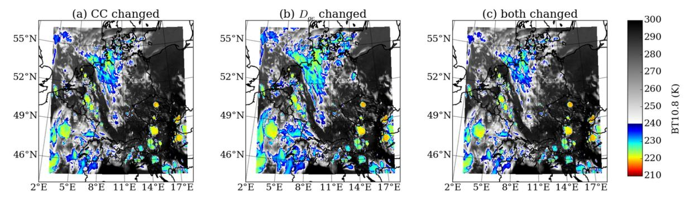
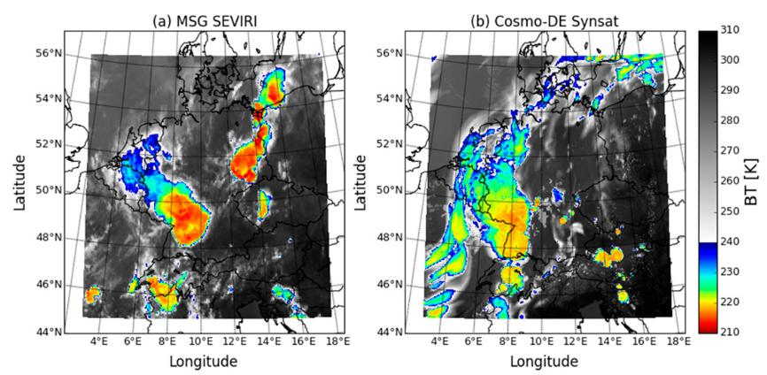
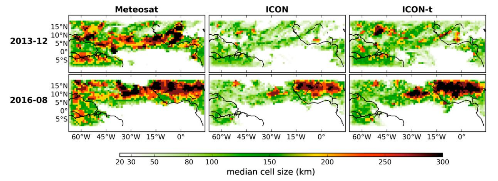
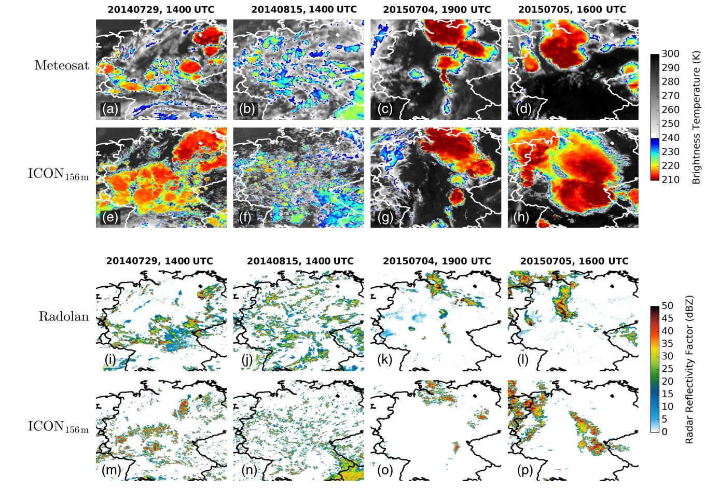
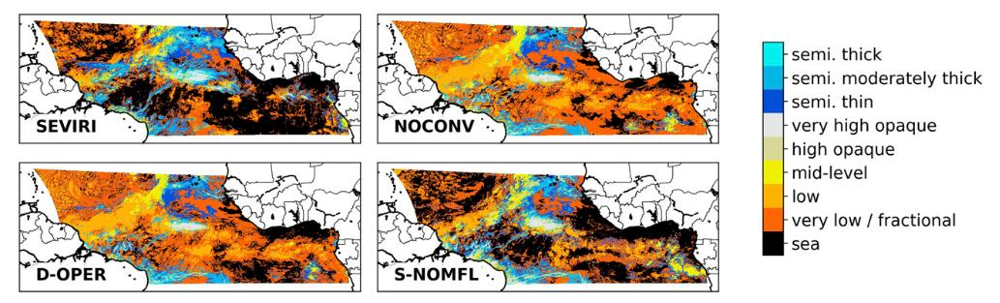
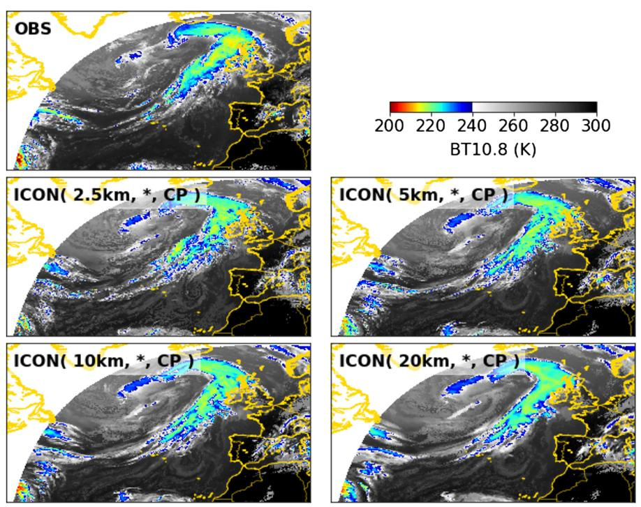

# Science behind SynSatiPy

Earlier version of the SynSat interface were utilized for scientific studies with various research targets, for instance to

- assess the realism of cloud characteristics in super high-resolution ICON simulations over Germany (https://doi.org/10.1002/qj.2947)

    

- investigate SynSat uncertainties in the presence of Cirrus clouds (https://doi.org/10.1016/j.atmosres.2016.08.012)

    

- characterize quality weather forecasts of deep convective development (https://doi.org/10.1175/MWR-D-16-0480.1)

    

- evaluate simulated deep tropical convection (https://doi.org/10.1175/MWR-D-17-0378.1)

    

- study convective organization over Germany (https://doi.org/10.1002/qj.3552)

    

- support development of innovate convection parameterizations (https://doi.org/10.1175/MWR-D-20-0107.1)
    

- study cloud radiative effects by cloud type (https://doi.org/10.1029/2020JD032667)
    
